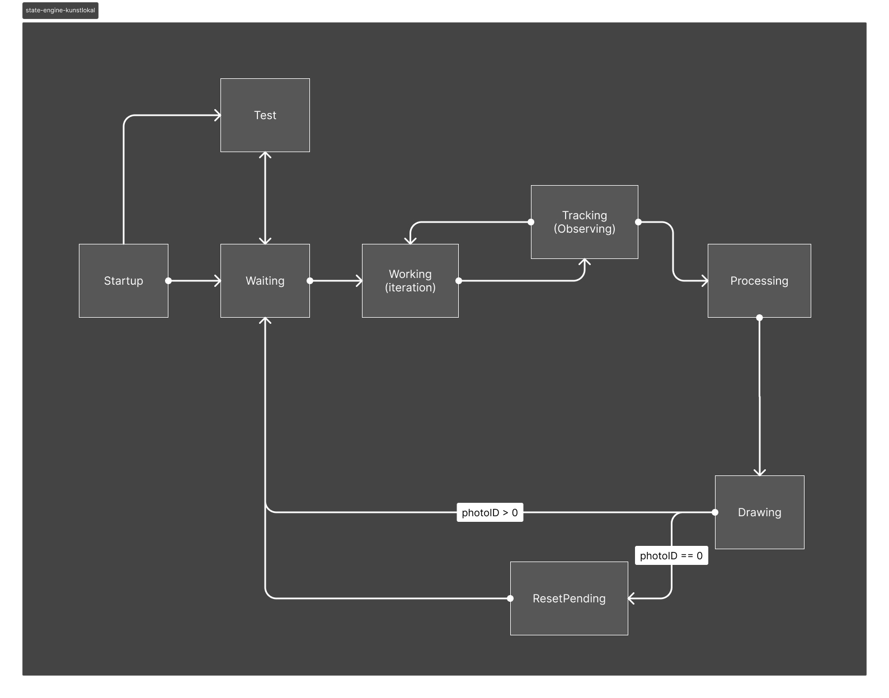

# photoplotter
The photoplotter project is a Python-based application designed to create a digital photobooth experience. It consists of several modules organized within a package structure. Here's a general project description:

**Description:**
The photobooth application allows users to take photos, process them, and print them with an axidraw penplotter. It simulates the experience of a traditional photobooth but with added digital features. 

**Classes:**

1. `photobooth.py:` This module contains the main logic for the photobooth application, coordinating interactions between different components.
2. `stateengine.py:` Manages the state of the photobooth, controlling transitions between different states such as idle, capturing, processing, printing and completed.
Should also track the current id of the current portrait drawing. Communicates with broker messages to output the current application state on `lcd.py`
3. `camera.py:` Handles camera functionality, including facetracking, capturing photos and providing them for processing. Saves snapped image temporary and source images for vectorization separately.
4. `imageparser.py:` Processes the snapped images captured by the camera, converting them to traced SVGs for plotting.
5. `plotter.py:` Manages the plotter connection and functionality to draw the portraits, which could be used for printing svg images with a axidraw penplotter.
6. `lcd.py:` Display interface of the photobooth, showing instructions and the current state of the application to users on a 128x128 lcd display. Located in a separate directory and communicates with broker to submit button inputs. Runs as a separate task.

**File Structure:**
The project is structured as follows:

```
photoplotter/
│
├── start.sh
├── main.py
│
├── lcd/
│   └── lcd.py
│
└── photobooth/
│   ├── __init__.py
│   ├── photobooth.py
│   ├── stateengine.py
│   ├── display.py
│   ├── camera.py
│   ├── plotter.py
│   └── imageparser.py
│   
└── photos/
	└── current/
	└── snapped/
	└── traced/

```

**Functionality:**

- Users interact with the photobooth by following on-screen instructions.
- They can capture photos using the integrated camera.
- The captured photos are processed, saved and plotted.

**Goals:**

- Create an intuitive and engaging photobooth experience.
- Ensure smooth transitions between different states of operation.
- Provide options for different target outputs, paper sizes or drawing complexity.

**Ideas:**

- Use facetracking instead of button input

This project aims to combine the nostalgic charm of traditional photobooths with modern digital technology, offering a fun and interactive experience for users of all ages.

**State-Engine**
- The project uses a state-engine.



## Startup

```bash
# Startup lcd display first
cd photoplotter
sudo python lcd/lcd.py
```

```bash
# Startup activate venv and run main second
cd photoplotter
source photoplotter-env/bin/activate
python main.py
```

<aside>
☝ Alternatively run `start.sh`
</aside>

## Setup repo

```bash
# Create venv
python -m venv photoplotter-env

# Install dependencies
pip install paho-mqtt==1.5.1
pip install opencv-python
pip install svgwrite==1.4.1
pip install Pillow
pip install lxml
pip install numpy
pip install paho-mqtt

python -m pip install https://cdn.evilmadscientist.com/dl/ad/public/AxiDraw_API.zip
```

<aside>
⚠️ After reinstallation make sure plotter sizes are correct in `axidraw_conf.py`
</aside>