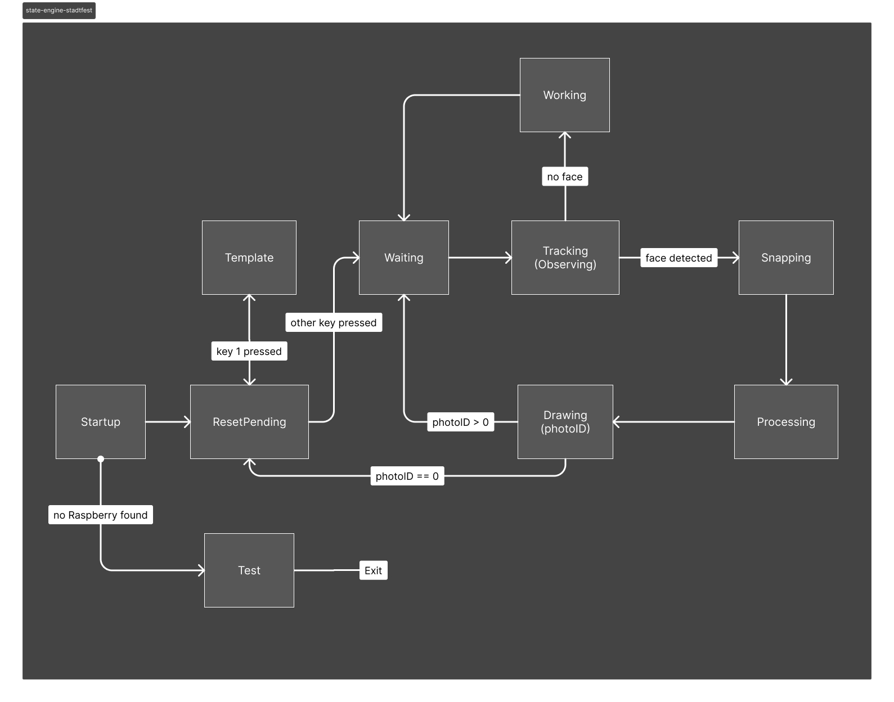

# photoplotter

The Photoplotter is a standalone Python-based installation that recreates the charm of a traditional photobooth with a digital twist. It captures visitors’ photos, processes them, and transforms them into abstract portraits, which are then drawn onto Post-it notes using an AxiDraw pen plotter.
The software is built around a modular architecture managed by a state engine, coordinating image capture, processing, and plotting. By combining computer vision, generative art, and physical drawing, the installation offers visitors a unique, interactive, and tangible memento of their experience.

**RDFN:**
This project has been developed by Philipp Lehmann from Redefine, a Zurich based UX/UI Design Studio
[RDFN](https://www.rdfn.ch/photoplotter)
[Redefine](https://www.redefine.studio)

## Main Classes:

1. `photobooth.py:` This module contains the main logic for the photobooth application, coordinating interactions between different components.
2. `stateengine.py:` Manages the state of the photobooth, controlling transitions between different states such as idle, capturing, processing, printing and completed.
Should also track the current id of the current portrait drawing. Communicates with broker messages to output the current application state on `lcd.py`
3. `camera.py:` Handles camera functionality, including facetracking, capturing photos and providing them for processing. Saves snapped image temporary and source images for vectorization separately.
4. `imageparser.py:` Processes the snapped images captured by the camera, converting them to traced SVGs for plotting.
5. `plotter.py:` Manages the plotter connection and functionality to draw the portraits, which could be used for printing svg images with a axidraw penplotter.
6. `lcd.py:` Display interface of the photobooth, showing instructions and the current state of the application to users on a 128x128 lcd display. Located in a separate directory and communicates with broker to submit button inputs. Runs as a separate task.

**File Structure:**
The project is structured as follows:

```
photoplotter/
│
├── main.py
├── plotfile.py
├── utils.py
│
├── lcd/
│   └── lcd.py
│
├── photobooth/
│   ├── __init__.py
│   ├── photobooth.py
│   ├── stateengine.py
│   ├── camera.py
│   ├── plotter.py
│   ├── imageparser.py
│   ├── nextdraw_conf.py
│   ├── shape_predictor/   # dlib 68-point face landmark model
│   ├── midas/              # MiDaS depth estimation model
│   ├── models/             # MediaPipe selfie segmenter model
│   └── haarcascades/
│
└── photos/
    ├── snapped/
    ├── traced/
    ├── collection/
    ├── output/
    ├── test/
    ├── samples/
    └── artists/

```

**Functionality:**

- Users interact with the photobooth by following on-screen instructions.
- They can capture photos using the integrated camera.
- The captured photos are processed, saved and plotted.
- When not connected to Pi the app goes into test mode and collects all images in the test folder.

**Goals:**

- Create an intuitive and engaging photobooth experience.
- Ensure smooth transitions between different states of operation.
- Provide options for different target outputs, paper sizes or drawing complexity.


This project aims to combine the nostalgic charm of traditional photobooths with modern digital technology, offering a fun and interactive experience for users of all ages.

**State-Engine**
- The project uses a state-engine.



## Startup

```bash
# Startup lcd display first (own venv, needs sudo for SPI/GPIO)
cd photoplotter
sudo lcd-env/bin/python lcd/lcd.py
```

```bash
# Startup activate venv and run main second
cd photoplotter
source photoplotter-env/bin/activate
python main.py
```


## Setup repo

```bash
# Create venv
python -m venv photoplotter-env
source photoplotter-env/bin/activate

# Install dependencies
pip install paho-mqtt==1.5.1
pip install opencv-python
pip install svgwrite==1.4.1
pip install Pillow
pip install lxml
pip install numpy
pip install paho-mqtt
pip install dlib
pip install scipy
pip install torch
pip install torch torchvision
pip install timm
pip install mediapipe

python -m pip install https://software-download.bantamtools.com/nd/api/nextdraw_api.zip
```


## Raspberry Pi Services
Create .service files to launch on startup
```

# Disable autostart
sudo systemctl stop photoplotter_lcd.service
sudo systemctl stop photoplotter_main.service
```
```
sudo systemctl disable photoplotter_lcd.service
sudo systemctl disable photoplotter_main.service
```
```
# Enable autostart
sudo systemctl start photoplotter_lcd.service
sudo systemctl start photoplotter_main.service
```
```
sudo systemctl enable photoplotter_lcd.service
sudo systemctl enable photoplotter_main.service
```
```
# Check status
sudo systemctl status photoplotter_lcd.service
sudo systemctl status photoplotter_main.service
```
```
# Zip & download with right click in vs code
zip -r photos.zip photos
```

<aside>
⚠️ After reinstallation make sure plotter sizes are correct in `nextdraw_conf.py`, there have been issues with the library to set the paper size correctly
</aside>


---


# LCD Setup (Waveshare 1.44" LCD HAT)

Setup notes for `lcd/lcd.py` on Raspberry Pi 5. This component runs in its own
venv (`lcd-env`), separate from the main `photoplotter-env`, and communicates
with the main script over MQTT.

## 1. Enable SPI

Required for the display hardware.

```bash
sudo raspi-config nonint do_spi 0
sudo reboot
```

## 2. Create a dedicated venv

Uses `--system-site-packages` so system-level GPIO libraries are visible.

```bash
cd ~/Documents/photoplotter
python3 -m venv lcd-env --system-site-packages
```

## 3. Install system build dependencies

```bash
sudo apt install swig -y
sudo apt install liblgpio-dev -y   # if not found, try: python3-lgpio
```

## 4. Install Python packages into the venv

```bash
lcd-env/bin/pip install paho-mqtt==1.5.1 Pillow psutil spidev gpiozero lgpio numpy
```

## 5. Install and start MQTT broker (Mosquitto)

`lcd.py` connects to a local MQTT broker on startup — required even for local-only testing.

```bash
sudo apt install mosquitto mosquitto-clients -y
sudo systemctl enable mosquitto --now
```

## 6. Run

Needs `sudo` for GPIO/SPI access.

```bash
sudo lcd-env/bin/python lcd/lcd.py
```

## Notes / gotchas

- **PEP 668 (`externally-managed-environment`)**: recent Pi OS blocks system-wide
  `pip install`. Use the venv above, or `pip install --break-system-packages` as
  a last resort.
- **`gpiozero` backend**: Pi 5 uses a new GPIO chip, so the classic `RPi.GPIO`
  pin factory doesn't work. Use `lgpio` instead.
- **`lgpio` build failure (`cannot find -llgpio`)**: the pip package compiles a
  C extension and needs `swig` + the system `liblgpio` library present before
  it will build. Install `liblgpio-dev` first.
- **`ConnectionRefusedError` on MQTT connect**: means no broker is running.
  Install and start Mosquitto (step 5).
- **Power supply**: heavy installs (e.g. `dlib`, `torch`) can brown out the
  Pi 5 on an underspec'd USB-C supply. Check with `vcgencmd get_throttled` —
  anything other than `0x0` means undervoltage has occurred since boot. Use
  the official 27W USB-C PD supply.